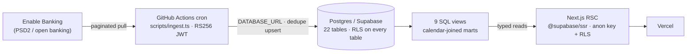
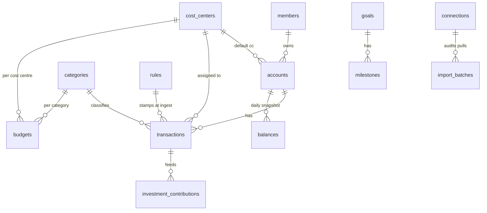

# finance-bi

> A household-finances platform modelled as a business — salaries as revenue, expenses as per-person cost centres, tracking toward a savings goal. Bank data is ingested automatically from open banking; it runs unattended in production and is in daily use.

[](https://github.com/lorenzobosio/finance-bi/actions/workflows/ci.yml)
[](https://github.com/lorenzobosio/finance-bi/actions/workflows/codeql.yml)

## What this is

Household income and spending are treated as a P&L: salary is revenue, spending is bucketed into per-person cost centres with budgets, and a fixed monthly contribution tracks toward a savings goal. Transactions arrive from a PSD2 open-banking provider (Enable Banking) via a scheduled, unattended pull; they are deduplicated, classified by a versioned rules engine at write time, and surfaced through calendar-joined SQL views. Every table is behind Row Level Security, and the data model — not application code — is the single source of truth for who may read it.

The stack is Next.js (App Router, RSC) · TypeScript · Supabase/Postgres · Drizzle ORM · PL/pgSQL · Zod · Vitest · Playwright · Tailwind/shadcn · Recharts, deployed on Vercel with ingestion running from GitHub Actions.

## Architecture



The `service_role` key never leaves the server: ingestion writes via a direct `postgres`/`DATABASE_URL` connection; the app reads with the `anon` key and lets RLS do the enforcement.

## The data layer

### Schema

22 tables and 9 views. The transactional and dimensional core:



`dim_calendar` (a seeded date dimension, 2024-01-01 → 2035-12-31, ~4,383 day rows / 144 `period_key`s) is joined by `period_key`/`date` to make every mart month-over-month comparable. Feature tables not shown: `app_allowlist`, `insights`, `buckets`, `household`, `goal_events`, `transfer_overrides`, `insight_thresholds`, `reconciliation_flags`.

### Migrations

18 versioned migrations (`drizzle/0000_init.sql` → `drizzle/0017_accounts_summary.sql`), applied with `drizzle-kit migrate`. Each is hand-written PL/pgSQL/DDL and idempotent-safe on a clean reset. The progression is the build history: schema → RLS on every table → ingestion columns → a versioned rules engine → calendar-joined marts → public-demo tenant isolation → member identity → goal/analytics features. The generated Postgres types are checked against the live schema in CI (see `types:drift`), so a renamed column fails the build instead of silently becoming `undefined`.

### Data marts

Nine `security_invoker` views model the reporting layer dimensionally. Aggregates are built on the `dim_calendar` spine via `LEFT JOIN`, so a month with no activity renders as a €0 row rather than a missing one — the property that makes MoM/YoY comparisons safe. `v_pnl_monthly` composes the household P&L; `v_costcenter_bva` is budget-vs-actual per cost centre; `v_balance_trend` is the net-worth series; `v_category_breakdown` / `v_pct_of_revenue` / `v_sublet_pnl` / `v_home_kpis` / `v_bucket_spend` / `v_account_summary` cover the rest.

```sql
-- drizzle/0007_marts.sql — the sublet P&L on the calendar spine.
-- LEFT JOIN onto dim_calendar guarantees a row per period_key; the FILTERed SUMs
-- split revenue vs cost from a single scan; COALESCE(...,0) fills empty months.
create view public.v_sublet_pnl
  with (security_invoker = on) as
with periods as (
  select distinct period_key from public.dim_calendar
)
select
  p.period_key,
  coalesce(sum(t.amount_eur)  filter (where t.flow_type = 'revenue'), 0)::numeric(14,2) as sublet_revenue,
  coalesce(sum(-t.amount_eur) filter (where t.flow_type = 'cost'),    0)::numeric(14,2) as sublet_costs,
  coalesce(sum(t.amount_eur),                                          0)::numeric(14,2) as sublet_net
from periods p
left join public.dim_calendar c on c.period_key = p.period_key
left join public.transactions t
  on t.booking_date = c.date
 and t.cost_center  = 'sublocacao'
group by p.period_key;
```

### Row Level Security — written and tested

RLS is enabled on **every** public table, and the allowlist is **data, not code**: access is gated on a `SECURITY DEFINER` function that checks the caller's JWT email against the `app_allowlist` table. The same table drives auth and RLS, so authorization and data access cannot diverge. The function bypasses `app_allowlist`'s own RLS (avoiding policy recursion), pins an empty `search_path` against hijack, and resolves the JWT once per query as an initplan.

```sql
-- drizzle/0001_rls_policies.sql
create or replace function public.is_email_allowed(check_email text)
returns boolean language sql stable security definer set search_path = '' as $$
  select exists (
    select 1 from public.app_allowlist a
    where a.email = lower(check_email)
  );
$$;

-- every table gets one policy of this shape:
create policy "allowlist_all" on public.transactions
  for all to authenticated
  using      ( public.is_email_allowed((select auth.jwt() ->> 'email')) )
  with check ( public.is_email_allowed((select auth.jwt() ->> 'email')) );
```

It is proven, not assumed. `test:rls` runs against the live database and asserts the allowlist is genuinely table-driven: it inserts a **temporary** synthetic email into `app_allowlist`, proves that identity now reads rows, deletes it, and proves access is revoked — while also asserting RLS is enabled on every table. A second suite, `test:rls:demo`, covers the public-demo surface: an additive `to anon using (is_demo = true)` policy exposes a synthetic dataset with **zero** real rows visible, and the test proves both directions (anon sees demo rows, anon sees no real rows, anon cannot write). Both run in CI.

## Automation & CI

| Workflow | What it does / guards |
|---|---|
| `ci.yml` | On every push/PR: lint, build, unit tests (Vitest), typecheck, the live RLS assertions, and the schema-drift gate. It also **greps the built `.next/static` bundle for the `service_role` key by name _and_ value** and fails if either leaked — verifying the boundary against the real artifact, not the build's word. A second job runs the Playwright E2E suite against a full Supabase local stack (migrate + seed + run). |
| `ingest.yml` | The ingestion pull — four scheduled runs a day plus manual dispatch, serialized so runs never race. Fail-soft: expired bank consent writes an `auth_expired` batch and exits 0 (a visible banner, never a silent retry). |
| `codeql.yml` | CodeQL security analysis on push/PR and weekly. |
| `dependabot-auto-merge.yml` | Native auto-merge for patch/minor dependency PRs — only once CI is green; majors are left for manual review. |
| `daily-maintenance.yml` | A daily health check: open security alerts, dependency PRs, and whether `main` is green. |

The ingestion job (`scripts/ingest.ts`) signs a 1-hour **RS256 JWT** to authenticate to Enable Banking (the JWT *is* the credential — no client-secret exchange), pulls each account's transactions paginated by continuation key plus a balances snapshot, Zod-validates the payload, computes a `dedupe_hash`, and **upserts `ON CONFLICT (dedupe_hash) DO NOTHING`** so a re-pull of the same window adds zero rows. The versioned rules engine stamps `flow_type` / `cost_center` / `category_id` at write time, and every run writes an `import_batches` heartbeat in a `finally` (also keeping the free-tier database warm).

## Engineering decisions

- **The database is the single source of truth for auth.** A `process.env` read in Edge middleware was unreliable in production and locked out a legitimate user. The allowlist moved into `app_allowlist`, checked by `is_email_allowed()` — the same table RLS already uses — so auth and data access can never drift. (JOURNEY.md, Learning #1)
- **PII stayed out of source _and_ git history.** Real emails were never committed (seeded into the DB from an env var at deploy time); git history was rewritten to purge them before going public, and `test/source-cleanliness.test.ts` fails CI if a forbidden literal reappears — reporting booleans only, so a failing CI log never leaks the value it protects.
- **`service_role` is proven absent from the client bundle, not assumed.** A three-layer guard: a server-only import boundary, an ESLint rule, and the CI grep of the served JS bundle for both the key's name and its value.
- **Idempotent ingestion over "insert and hope."** `dedupe_hash` + a unique constraint make re-pulls free, and the pipeline is forward-only (no historical backfill), so the daily cron can run unattended without producing duplicates or needing reconciliation.
- **Empty months are €0, not missing.** Every mart is built on the `dim_calendar` spine so MoM/YoY joins never drop a period — comparability is a property of the schema, not of careful querying.

## Running it locally

```bash
pnpm install
cp .env.example .env.local        # fill in DATABASE_URL + Supabase keys

pnpm db:migrate                   # apply the 18 migrations
pnpm test                         # unit suite (Vitest)
pnpm test:rls                     # live RLS assertions (needs DATABASE_URL)
pnpm types:drift                  # generated types vs live schema
pnpm dev                          # http://localhost:3000
```

Ingestion and the demo seed: `pnpm eb:connect` (one-time open-banking consent), `pnpm ingest` (a pull), `pnpm db:seed:demo` (the PII-free synthetic dataset). The Playwright E2E suite runs against a local Supabase stack: `pnpm e2e:install && pnpm e2e`.

## Stack

Next.js 15 (App Router / RSC) · TypeScript · Supabase Postgres · Drizzle ORM · PL/pgSQL · `@supabase/ssr` · Zod · Vitest · Playwright · Tailwind + shadcn/ui · Recharts · `jose` (RS256) · GitHub Actions · Vercel.
